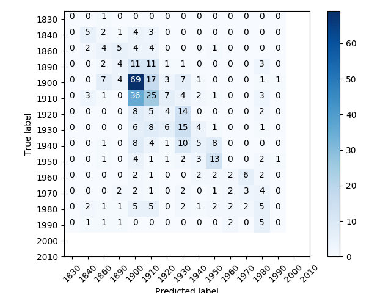

# Age Prediction for Buildings using Google Street View Images

- Developed for: Dr. Teshima and Dr. Nakajima
- Developed by: Omar Trejo

## Introduction

The approach taken in this system follows the general outline shown in
Zeppelzauer, Despotovic & Sakeena's, "Automatic Prediction of Building Age from
Photographs" (2018), with a few tweaks.

## Data setup

- TODO: Describe data set

### Step 1: Unification

Since the data sets are spread through different subdirectories and files, this
script is used to bring all of the relevant data into a single CSV file, located
in [`outputs/data.csv`](./outputs/data.csv) and all the images are retrieved
using the address provided in the data files and taken from the Google Street
View API. The images are saved in the [`outputs/images/`](./outputs/images)
directory.

This process will result in many images which are not useful due to various
reasons. Some of these reason could be that the image is from inside a building
instead of outside, the image is occupied by non-interesting objects (trees,
cars, etc) instead of the actual building, the image has a very bad resolution,
and/or the image has very bad lighting conditions, among many others. To help
alleviate that problem, we use a second script for data deletion.

### Step 2: Deletion

Once all of the data has been retrieved (the
[`outputs/data.csv`](./outputs/data.csv) file has been created, and the images
are located in the [`ouputs/images/](./outputs/images/) directory), the user may
delete as many images as he/she wants from the
[`outputs/images/`](./outputs/images/) directory. These deletions should occur
for any image that does not fit quality standards for the project, and a good
question to answer would be "If I gave this image to a person trying to predict
the building's age, would it be useful for them?". If the answer is no due to
ambiguity on the building being predicted, or lack of details, or whatever other
reason, then the image should be deleted.

Once all of the desired deletions have been performed, the script associated to
this step can be used to detect which are the images that were deleted and also
delete their records from the [`outputs/data.csv`](./outputs/data.csv) file to
keep all our data consistent.

Currently, after using this approach, we kept 1,617 observations in the dat,
each of which has a related building image. The image deletion process described
above was performed only for the first 5,000 images. Any image above the first
5,000 was deleted independently of it's quality due to time restrictions. At a
later stage, we will be more careful in which images we're actually keeping, and
will re-execute the whole system; for now we're just making sure it works.

## Methodology

Once we have the data necessary for the system, we proceed with a 6-step
methodology to produce predictions for buildings given their tabular data as
well as their images.

### Step 0: Baseline

To understand whether using images helps the predictive accuracy for the age of
buildings, we must use a baseline for comparison. In this case the baseline is
created with a Random Forest that only uses the tabular data available in the
[`outputs/data.csv`](./outputs/data.csv) file.

Currently, this approach yields 154/1,1617 correct decade predictions (~9.5%).
The confusion matrix looks as shown below. The hope is that introducing images
into the predictions will help improve this result.

### Step 1: Patch Extraction

The approach taken in this system is to use image patches, instead of full
images, to train the predictive models. The idea is that if those patches are
chosen intelligently, they will represent relevant architectural choices for the
buildings being analyzed, and will therefore be more useful for the predictive
models than simply using the full images, which may contain a lot more
information, but many of it could be useless.

When extracting patches, there's a trade-off: if the image is too large, the
relevant information, which may be hidden in a detail, can be lost in the
vastness of the remainder of the image, but if the image is too small, we may
loose contextual information about what it "belongs" to (e.g. corner of a door
vs corner of a window). The obvious solution is to take patches of different
sizes, but that hinders out ability to simplify our predictive model since we
would need various input sizes. Instead what we do is take a "large" size as
well as a "small" size, and compress the "large" size images to the same size of
the "small" size images. We may loose some information in that compression, but
we will gain more predictive power than if we did not include the "large" size
images.

Our specific approach simply takes takes every possible sub-image for given
dimensions and "skip" parameters (how many pixels to slide the "window").
Specifically since our images are 500x500 pixels, we could choose to take every
100x100 pixel image moving 1 pixel at a time (both right and down, assuming we
start from the top-left corner). If we do that, we would get over a hundred
thousand patches for every building image. Of course that seems excessive and
will have many redundant information, so the code allows for parameterization of
pixel movements and image sizes. The actual parameters being used right now are:

- "Small" images
  - 50x50 pixels
  - Moving 25 pixels
  - Produces 361 images

- "Large" images
  - 100x100 pixels
  - Moving 50 pixels
  - Produces 79 images

> **NOTE**: For testing purposes only a configuration with 100x100, moving 100
> pixels at a time (no overlapping at all) is used to keep the number of patches
> low, and thus be able to run through the full system faster.

Each patch requires around 1.1 KB of space, and since the current approach
produces 442 patches per building image, from which we have 1,617, we need 0.78
GB of space to store all patches. Additionally, we need around 40 KB of space
per building image (which are already greatly compressed by the Google Street
View system), which requires another 0.06 GB. Of course, as we allow for more
building images from the beginning, and allow to use larger numbers of patches,
these space requirements can quickly increase.

### Step 2: Label Extraction

The approach taken by Zeppelzauer, Despotovic & Sakeena's, "Automatic Prediction
of Building Age from Photographs" (2018) uses a mechanism to group clusters of
objects, and then select images from within them. Our approach here is a bit
different, since there seem to be too many patches being created that do not
contain any relevan architectural information (e.g. grass, dogs, cars, sky,
etc), the Google Vision API could be used to get labels for each patch, and use
those labels to discriminate among which paches to keep or not. However, using
the Google Vision API would yield very high expenses, so instead of using it
directly, I decided to replicate a simpler version of how it works internally.
To do that, I use the [Inception (version 3)](https://arxiv.org/abs/1512.00567)
[Convulational Neural
Network](https://en.wikipedia.org/wiki/Convolutional_neural_network), which
comes pre-trained with a very large amount of data from the
[ImageNet](http://image-net.org/) 2012 challenge data set.

The label extraction mechanism we use here goes through all the patches
generated for a building image, and gets the top label associated to it, using
the Inception CNN, and saves it into a CSV. Then human interaction is required
to assign an `action` to each of those labels as either `keep` or `delete`. In
the next step in the pipeline, any patch whose primary label is found in this
CSV and is marked to be deleted, will be deleted. It's a robut way to easily
delete a lot of patches that do not provide meaningful information for the
predictive models, and it's a bit different from what Zeppelzauer, Despotovic,
and Sakeena used.

### Step 3: Patch Selection

The patch selection takes place in two phases: deletion through labels, and
selection through "high contrast". The first one, deletion through labels, is
explained in the previous section ("Step 2: Label Extraction"). The second one,
selection through "high contrast", works by producing a "score" for all the
patches associated to an image, and selection the top `n` images according to
tha score. The idea is that "low-contrast" patches are related more commonly to
non-relevant areas (e.g. grass, sky, wall, etc), and keeping them would not
yield valuable information for the predictions.

The score currently being used uses information from each image's three color
channels. To give a bit of context, each pixel has three values (channels)
associated with it, commonly refered to as RGB (for red, green, blue). Each of
these values can be between 0 and 255, 0 being black, and 255 being the maximum
value that particular color can be. Our current scoring mechanism produces a
histogram for each channel, where each value in the histogram's x-axis
represents a pixel value (0 to 255). The histogram expresess the color
distribution for each channel, and we use the mean of all three variances, with
the idea that higher variances imply higher contrast images.

After both phases have been applied, we will have patches that are related to
relevant labels and which have the highest contrast available for each
building's image.

### Step 4: Path Augmentation

Once we have selected a number of patches for each building image, we want to
remove our dependency on the specific lighting conditions and angle/orientation
which happend to occur when the image was taken (these are taken by cars that
circulate through streets and images are subject to changes in time of the day,
weather conditions, angles, etc). To remove our dependency from such factors, we
use data augmentation so that brightness, rotation, and contrast of each patch
is adjusted randomly, to account for different illumination contexts.

The mechanism works by creating "new" patches which are copies of the patches we
already had selected with modifictions on top of them. The modifications are
random and are applied independently (a patch will not be both rotated and
brightened at the same time, but two different patches, each of which has each
of those effects, can certainly occur). This helps expands the amount of image
data we have using the best patches, which were selected in a previous step, to
create new patches that reduce our dependency on a picture's specific contexts.

### Step 5: Model Training

- TODO: Finish when ready

### Step 6: Model Testing

Three types of testing should be performed to get an accurate sense of how well
this predictive system works. The first one is the standard cross validation
technique common to Machine Learning problems, in which a subset of the data is
never used during the training phases and is used to test the predictions of the
trained models. This file performs this type of testing.

The second test is to compare the predictive accuracy of the current models
against those of the Random Forests that only use the tabular data (without the
images) and find different parameter optimizations in both to get a sense of the
relative performance among them.

The third test is to compare against the predictions provided by professional
humans that are trained to identify building age. This is probably not feasible
for the current project, but it should be used to get a sense of how well the
algorithm performs against a "reasonable stanadard", and it's a technique also
used by Zeppelzauer, Despotovic, and Sakeena.

## File descriptions

### [`inputs/datasets/[1..5]`](./inputs/datasets/)

Each subdirectory in this directory is treated as the location of a dataset, and
each `metadata.json` file within those subdirectories specifies how to handle
the dataset within. These are used as inputs to retrieve building ages and the
addresses that are used to retrieve the Google Street View images.

### [`inputs/imagenet/`](./inputs/imagenet/)

If this directory does not exist, it will automatically be created when
attempting to use the Inception image classifier, and a all the necessary files
will be placed within it. If it exists, those files will not be re-downloaded.

### [`labeler/labeler.py`](./labeler/labeler.py)

`Labeler` class. It's purpose is to use Inception (version 3), the image
classification Convolutional Neural Network (CNN) which is pre-trained with the
ImageNet 2012 challence data set. The class creates a graph from a saved
`GraphDef` protocol buffer, and runs inference on an input `JPEG` image. The
`labels()` method outputs a list strings of the top `n` predictions.

> **NOTE**: If the probability for each prediction is required, the `labels()`
> method can easily be extended to provide it.

### [`outputs/images/<ID>.jpeg`](./outputs/images/)

The files in this directoy contain a Google Street View image for the
corresponding `ID` in the [`./outputs/data.csv`](./outputs/data.csv) file.

### [`outputs/data.csv`](./outputs/data.csv)

This file is created automatically using the inputs of the `inputs/datasets/`
directory, and it contains the information used to predict building ages. The
`ID` for each row is used as the name of the corresponding image in the
`outputs/images/` directory.

### [`outputs/labels.csv`](./outputs/labels.csv)

This file is created automatically when performing the second step, and it
contains two columns: `label` and `action`. The usage of these values is
described in the appropriate section.

### [`scripts/analysis/area-year-statistics.py`](./scripts/analysis/area-year-statistics.py)

This script calculates descriptive statistics for the numeric variables in the
specified area. The area is specified using a center and a radius around that
center. All buildings within that area are used for the calculations.

### [`scripts/analysis/image-similarity.py`](./scripts/analysis/image-similarity.py)

This script takes inputs from different images in the `inputs/similarity/`
directory and produces similarity metrics among them. Specifically, it produces
a Structrual Image Similarity (SSIM), Normalized Mean-Squared-Error (NRMSE), and
Mean-Squared Error (MSE) metrics. When comparing images, the MSE, while simple
to implement, is not highly indicative of perceived similarity. SSIM aims to
address this shortcoming by taking texture into account, and that's why we use
it here.

> **NOTE**: The comparison is performed after transforming images into a
> gray-scale (instead of using full color images). This simplifies the process,
> but may loose some information in the process.

> **NOTE**: This code is not used in any process for the predictive system, and
> was developed as a request related to this project by Dr. Teshima, but is not
> used elsewhere.

### [`scripts/pipeline/0-baseline.py`](./scripts/pipeline/0-baseline.py)

This script creates a baseline predictive accuracy produced by a Random Forest
classifier using only the tabular data available in the
[`outputs/data.csv`](./outputs/data/csv) file. This will be used as a baseline
to compare to when adding image information to the predictive process.

### [`scripts/pipeline/1-patch-extraction.py`](./scripts/pipeline/1-patch-extraction.py)

This script is used to retrieve different patches from the images in the
[`outputs/images/`](./outputs/images) directory. Each of these patches is saved
under a subdirectory in the [`outputs/images/`](./outputs/images/) directory,
where the name of the subdirectory is the name of the image, which in turn is
the ID for an observation in the data.

### [`scripts/pipeline/2-label-extraction.py`](./scripts/pipeline/2-label-extraction.py)

This script uses the `Labeler` class to extract the top label for each patch.
All of these labels are saved into the
[`outputs/labels.csv`](./outputs/labels.csv) file. That file contains two
columns: the `label` which was extracted using the Inception v3 CNN, and the
`action`, which may either be `keep` or `delete`. If it's `delete`, the next
script in the pipeline
([`scripts/pipeline/3-patch-selection.py`](./scripts/pipeline/3-patch-selection.py)
will delete any image whose top label is marked as such. If it's `keep`, the
patch will not be deleted using this technique.

### [`scripts/pipeline/3-patch-selection.py`](./scripts/pipeline/3-patch-selection.py)

This script applies to techniques for patch selection. The first one uses the
top label associated to a patch using the Inception v3 CNN, such that if it's in
the [`outputs/labels.csv`](./outputs/labels.csv) file, and it's marked with an
`action` of `delete`, then it will be deleted. The second one uses a scoring
mechanism where the score is computed using the mean variance within each color
channel (red, green, blue). Those with the highest scores are kept.

> **NOTE**: The patches that were not selected are deleted from the
> subdirectories in the [`outputs/images/`](./outputs/images/) directory.

### [`scripts/pipeline/4-patch-augmentation.py`](./scripts/pipeline/4-patch-augmentation.py)

Three different data augmentation techniques for images are used: random
brightness, random rotations, and random contrast. The number of augmentations
to be performed are parameterized using the `N_RANDOMIZATIONS` variable in the
appropriate script. All of the data augmented patches are saved in the same
location in which the original patches were.

### [`scripts/pipeline/5-model-training.py`](./scripts/pipeline/5-model-training.py)

- TODO: Finish when ready

### [`scripts/pipeline/6-model-testing.py`](./scripts/pipeline/6-model-testing.py)

- TODO: Finish when ready

### [`scripts/data/1-unification.py`](./scripts/data/1-unification.py)

This script uses the files from the [`inputs/datasets/`](./inputs/datasets)
subdirectories and transforms them into usable files for the predictive system's
processes. Specifically, it creates the [`outputs/data.csv`](./outputs/data.csv)
file, and the images in the [`outputs/images/`](./outputs/images) directory. It
uses Google Street View to retrieve images, and retrieves the largest available
image.

> **NOTE**: Some of the images saved by this process are inaccurate or include
> non-building objects as their main focus. These need to be filtered out before
> proceeding with the rest of the process. We could attempt to make this process
> automatic using the Google Vision API, which produces labels for the objects
> it detects in the images, but due to cost consideration, it's currently being
> done by human interaction.

### [`scripts/data/2-deletion.py`](./scripts/data/2-deletion.py)

After the images that do not provide accurate representation for their
respective addresses/buildings have been manually deleted from the
[`outputs/images/`](./outputs/images) directory, this script can be executed to
find out what where the deletions and remove their corresponding entries in the
[`outputs/data.csv`](./outputs/data.csv) file. This is a convenience script to
keep a consistent state among data and images.
